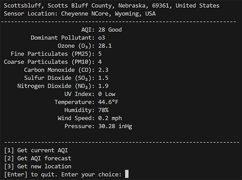
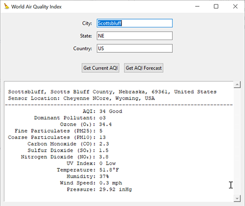
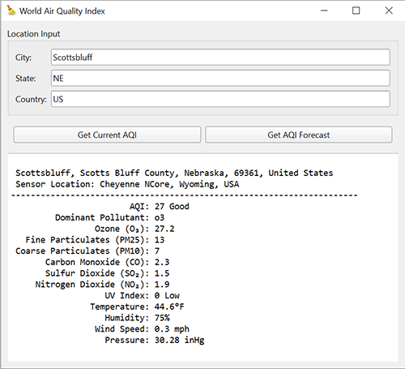

# World Air Quality Project App - Built in Python

## Description

This project is a demonstration for a WNCC Computer Science class of software development using Claude AI and Copilot in VSCode as code helpers. Educational GitHub users can use Copilot in VSCode for free.

**Rule of thumb:** Never ask AI to do something you don't already know how to do yourself.

I created the CLI version. I used Claude and Copilot to create GUI versions from the CLI code. AI created the skeleton framework of the GUI.

The next step is modifying the GUI code.

- CLI (I created this program from scratch.)
- I used Claude and Copilot to help create GUI versions.
  - Tkinter
  - PySide6

## CLI

## Tkinter

## PySide6

- Facebook: [Facebook WNCC IT Program](https://www.facebook.com/wnccitprogram/)
- YouTube: [YouTube WINCC IT Program](https://www.youtube.com/@williamloringitinstructor)

### License

 This work is licensed under a <a rel="license" href="http://creativecommons.org/licenses/by-nc-sa/4.0/">Creative Commons Attribution-NonCommercial-ShareAlike 4.0 International License</a>.

Copyright (c) 2024 William A Loring
